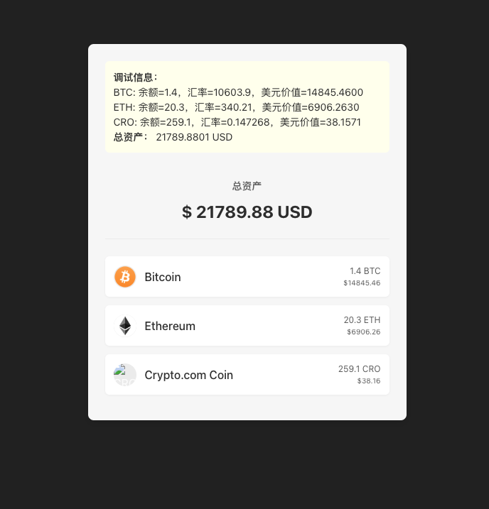

# Crypto.com Web interview demo project

This is a coding test for Web candidates for Crypto.com Shenzhen Team. This Demo project is a tiny taste of what you'll be working on if you join us.

Before proceeding to the section of your choice, please consider the following tips.

## General Advice and Tips

- Error scenarios，e.g. edge case/conner case, should be taken into consideration, even if you don't explicitly handle them.
- Although UI and UX are important, we are more concerned in this demo with your thought process and with how you architect your application. Your demo should take into consideration features that might be added in the future.
- Consider the security, maintainability and testability of the code.
- Clean the file project structure and remove any unused methods. This shows attention to detail.
- Be opinionated regarding any architecture you use and take your time to make it a reflection of your thought process.

## The project

You will implement a simple Wallet Dashboard.

- The Wallet app should support the following currencies: BTC, ETH, and CRO.
- Data Source: three JSON are provided as data sources
- (1) [Supported Currencies](json/currencies-json)
- (2) [exchange rate for each currency to US Dollars](json/live-rates-json). For instance, if the user has 0.0026 BTC, and the live rate from BTC to USD is 9194.9300000000, then the USD balance for the currency is 0.0026 \* 9194.9300000000 = 23.906818 USD
- (3) [Wallet Balance for each currencies](json/wallet-balance-json)

### Demo Screenshot

### Requirements

The following requirements should be met:

- Use TypeScript + React + vite.
- It should compile and run.
- You must create a private repo in Github for this project，and commit your code to the repo continuously in git commits. Send us the link to the repo when you are done.
- You should finish this in 3 days.

### Thanks for your time!
